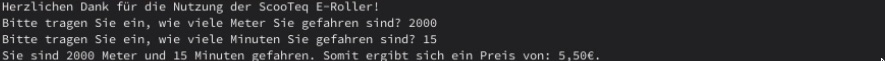

# Fahrkostenrechner ScooTeq GmbH

Diese Anwendung wird den Nutzern von SqooTec zu einer Summe in Euro verhelfen, je nachdem wie schnell und wie lange sie den Scooter benutzt haben.

## Installation

- installiere python3 und git
- klone das Repository mit

```
git clone https://github.com/niamai/lf2fahrkosten.git
```

- oder lade dir das [Zip](https://github.com/niamai/lf2fahrkosten/archive/refs/heads/main.zip) herunter und entpacke es

- (im Terminal) wechsle in den Ordner, wo die "fahrkosten.py" liegt

```
cd [Ordnerpfad]
```

- und führe das Programm aus mit:

```
python fahrkosten.py
```

- der python-Befehl kann sich je nach python-Version unterscheiden: `python3, python, py`.

## Verwendung



## Contributing

Pull requests are welcome. For major changes, please open an issue first to discuss what you would like to change.

Please make sure to update tests as appropriate.

## License

[MIT](https://choosealicense.com/licenses/mit/)
